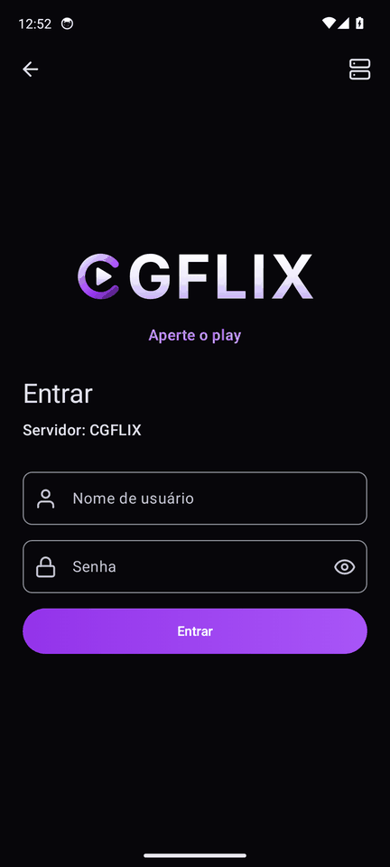
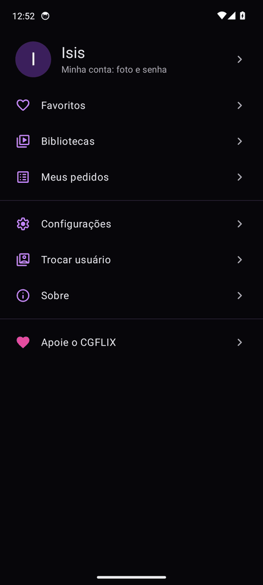
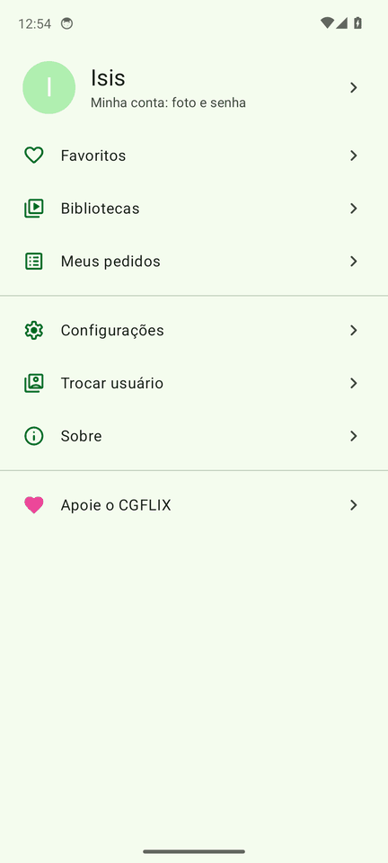
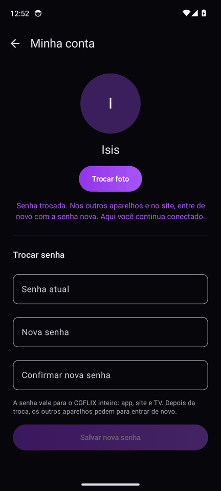

<p align="center"><picture>
  <source media="(prefers-color-scheme: dark)" srcset="cgflix-brand/cgflix-marca.svg">
  
</picture></p>

# CGFLIX Lite

App Android **leve** para assistir ao CGFLIX, o servidor de mídia (Jellyfin) particular de família e amigos.
Feito para celular simples e internet ruim: abre rápido, gasta pouca memória e toca o vídeo direto, sem conversão no
servidor. Interface em português do Brasil.

É um fork do [Findroid](https://github.com/jarnedemeulemeester/findroid) (GPL-3.0). O irmão completo é o
[`cgflix-app`](https://github.com/CaioGuerras/cgflix-app), um fork do Plezy.

| Entrar | Você (tema Isis) | Você (tema Heitor) | Minha conta |
|---|---|---|---|
|  |  |  |  |

## O que ele faz

- **Início por categoria**: chips Filmes, Séries e Animes, com as linhas Continuar assistindo, Em alta no Brasil
  (Top 10) e recentes.
- **Busca única**: primeiro o que já está no servidor, depois o que dá para **pedir** (Seerr), sem sair do app.
  A tela Meus pedidos mostra a situação de cada pedido.
- **Página do título**: botão grande Assistir ou Continuar S01E03, selos **Dublado** e **Legendado**, e temporadas em chips.
- **Player** ExoPlayer ou mpv (legenda ASS de anime com estilo), com áudio e legenda num menu pequeno que não pausa o vídeo.
- **Dois temas**: **Isis** (escuro, roxo, o padrão) e **Heitor** (claro, verde), além do Automático. O ícone do app
  muda junto com o tema.
- **Minha conta**: trocar a foto e a senha pelo próprio app. A senha vale para o app, o site e a TV.
- **Downloads** para ver sem internet (do Findroid).
- **Apoie o CGFLIX**: gorjeta opcional, que não desbloqueia nada. No APK é por Pix e na Play é pelo Google Play Billing.

Requer Android 9 ou mais novo. O app não traz endereço de servidor embutido: na primeira abertura, informe o endereço
do seu Jellyfin.

## Instalar

- **Google Play**: por enquanto só no teste interno. Peça ao dono para colocar seu e-mail na lista de testadores.
- **APK**: o workflow "CGFLIX Android" gera o APK a cada push no `main` (artifact `cgflix-lite-apk`). Use `arm64-v8a`
  na maioria dos celulares e `armeabi-v7a` nos antigos e nas TV boxes.

## Compilar

```bash
./gradlew :app:phone:assembleLibreRelease   # APK (Pix)
./gradlew :app:phone:bundlePlayRelease      # AAB para a Play (Play Billing)
```

Sem os secrets de assinatura, o release sai com a chave de debug (veja "Assinatura do APK" no [CGFLIX.md](CGFLIX.md)).

## Para quem mexe no código

- **[CGFLIX.md](CGFLIX.md)**: tudo o que mudou em relação ao Findroid, versão por versão, com os arquivos alterados,
  além de como sincronizar com o upstream e os próximos passos.
- O código próprio fica em `app/phone/src/main/java/dev/jdtech/jellyfin/cgflix/`. Nos arquivos do Findroid só entram
  ganchos curtos marcados com `CGFLIX`, para o merge com o upstream continuar simples.
- Os workflows "CGFLIX Android" (APK, AAB e testes), "CGFLIX Telas" (capturas no emulador, nos dois temas) e "Format"
  rodam em todo PR. Os PRs vão sempre para o `main` deste repositório, com descrição em português.

## Créditos e licença

O CGFLIX Lite existe graças ao **Findroid**, de [Jarne de Meulemeester e colaboradores](https://github.com/jarnedemeulemeester/findroid).
Todo o crédito do app original é deles. Se você usa Jellyfin e não é do CGFLIX, use o Findroid
([Google Play](https://play.google.com/store/apps/details?id=dev.jdtech.jellyfin),
[F-Droid](https://f-droid.org/packages/dev.jdtech.jellyfin)).

Licença [GPLv3](LICENSE), a mesma do original. Os ícones são Material Symbols (Apache 2.0, Google). A marca CGFLIX
fica em `cgflix-brand/`.

Android é marca registrada da Google LLC. Google Play e o logo do Google Play são marcas registradas da Google LLC.
